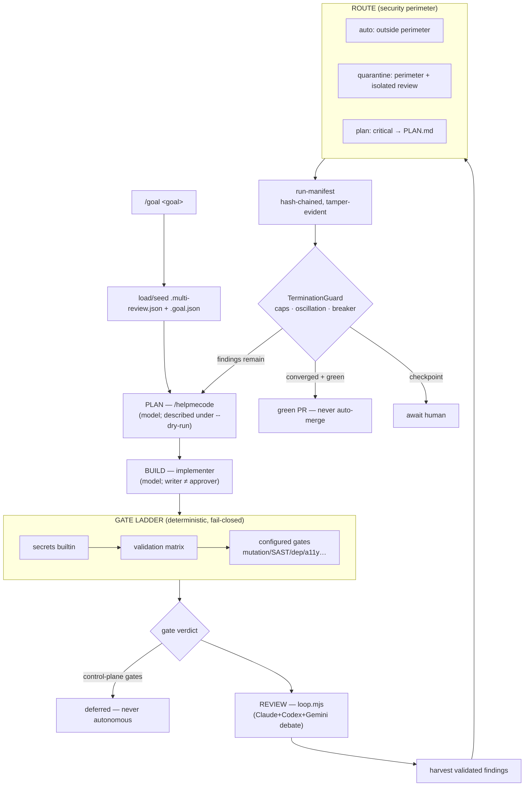

# Architecture (as built)

This reflects what is **implemented and tested** today, not the full roadmap. See
`docs/ROADMAP.md` for the implementation-status table and what's still designed-only.

## Module map

```
multi-review/
├── goal.mjs              # /goal orchestrator — the loop driver + gate runner + manifests
├── loop.mjs              # multi-review autonomous review loop (Claude+Codex+Gemini)
├── lib/
│   ├── core.mjs          # tested PURE core: perimeter, routing, termination, gates,
│   │                     #   secrets, provenance (manifest chain), arg/cmd helpers
│   ├── sh.mjs            # shared IMPURE shell/git helpers (tool detection, runCmd,
│   │                     #   changedFiles, trusted-base/working-tree git probes)
│   ├── metrics.mjs       # self-eval: bug-escape + slop rate, keep-a-rewrite rule
│   └── synth.mjs         # mutation-guided test-synthesis acceptance gate (deterministic
│                         #   half wired as /goal's optional `synth` gate; generation external)
├── scripts/
│   └── deny-copyleft.mjs # license-policy gate (GPL/AGPL/SSPL), reads ScanCode JSON
├── commands/             # /goal + /multi-review slash commands
├── skills/helpmecode/    # the planner skill (interview→research→design→handoff)
├── test/                 # node:test suites (83 tests) — unit + integration
└── .goal.example.json    # the full degradable gate ladder (copy to .goal.json)
```

`goal.mjs`, `loop.mjs`, `metrics.mjs`, and `synth.mjs` all build on the single tested
`lib/core.mjs` (pure logic) and share `lib/sh.mjs` for shell/git side effects — one source
of truth for the risky logic, no per-CLI copies.

## Two review engines (intentional)

There are two ways to run a multi-model review; they share `lib/core.mjs` + `lib/sh.mjs`
but differ by design:

| | `commands/multi-review.md` | `loop.mjs` |
|---|---|---|
| Driver | Claude orchestrates interactively | autonomous, unattended, multi-round |
| Auto-apply scope | severity ≥ high, mechanical | high/medium/low, outside perimeter |
| Apply isolation | isolated git worktree | isolated git worktree (`applyInWorktree`) |
| Trusted policy source | base revision (`git show <base>:…`) | trusted base branch (same intent) |
| Config-edit guard | edits to `.multi-review.json` ⇒ report-only | same |
| Clean-tree precondition | n/a (worktree) | required (for clean cherry-pick) |

Both enforce the same **`--apply` guardrails** (default-branch refusal, trusted-base
perimeter, config-edit ⇒ report-only) and both now apply each fix in an **isolated git
worktree**, cherry-picking onto the branch only if validation stays green — a failed fix
never touches your working tree. The remaining difference is intent: `loop.mjs` is the
autonomous engine (also fixes medium/low, but only outside the perimeter, validation-gated,
branch-only); the interactive command stays conservative (high-only) because a human is in
the loop.

## The loop (implemented spine)



## Key invariants (enforced in code)

- **Fail-closed perimeter** — `routeFinding`: critical or protected-path findings never go to
  `auto`; ambiguity (no file) counts as inside. (`lib/core.mjs`, tested.)
- **Fail-closed gates** — `gateVerdict`: a required gate that didn't pass blocks; a required gate
  whose tool is absent fails closed; skipped/control-plane gates never block. (Tested.)
- **Data-plane vs. control-plane** — control-plane gates (deploy) never run autonomously.
- **Guaranteed termination** — `TerminationGuard`: round cap, time budget, oscillation
  fingerprint, consecutive-failure breaker; never blocks-and-waits. (Tested.)
- **Tamper-evident provenance** — each run-manifest carries `prev = sha256(previous)`;
  `verifyChain` / `goal --verify` detect any alteration. (Tested.)
- **`--apply` guardrails** — `loop.mjs` refuses on the default branch, requires a clean
  working tree, loads the perimeter from the trusted base branch, refuses an empty perimeter,
  and falls to report-only if the change edits `.multi-review.json` — a change can't weaken
  its own guardrails. Each fix is applied in an isolated worktree and cherry-picked only if
  validation holds (`applyInWorktree`), so a failed fix never touches your tree. (Tested:
  `test/loop.integration.test.mjs`, `test/sh.worktree.test.mjs`.)
- **Self-evaluation** — `selfChangeAcceptable`: a self-rewrite is kept only if neither
  bug-escape-rate nor slop-rate worsens and one improves. (Tested.)

## Modes

| Command | Runs models? | Purpose |
|---|---|---|
| `goal.mjs "<goal>" --checkpoints` | yes | large build, human-gated |
| `goal.mjs "<goal>" --auto --apply` | yes | small update, unattended on a branch |
| `goal.mjs --gates-only` | no | CI — deterministic gate ladder + manifest |
| `goal.mjs "<goal>" --dry-run` | no | observe the spine; describe model phases |
| `goal.mjs --metrics` | no | bug-escape + slop-rate trend |
| `goal.mjs --verify` | no | check a run's manifest hash-chain |
