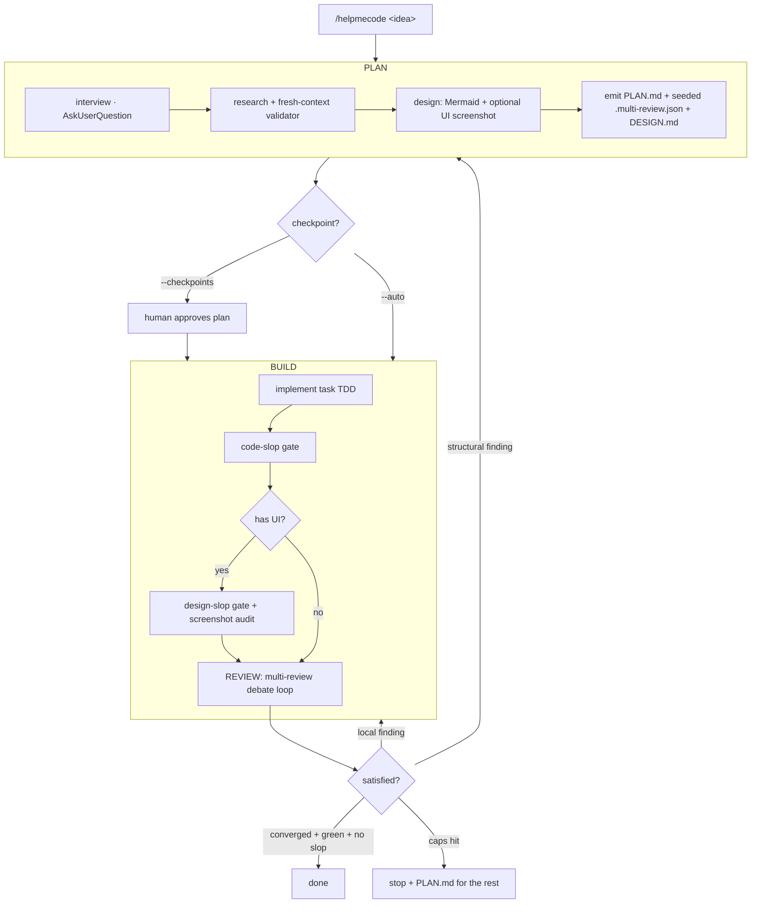

# Roadmap — from `multi-review` to a one-stop build↔review loop

> Status: **proposed / for approval.** This is a planning artifact, not a commitment to code.
> It extends the existing `multi-review` tool with an enhanced planner (`/helpmecode`),
> anti-slop quality gates, and an outer autonomous loop that ties them together.
>
> Build-vs-borrow decisions, license analysis, pitfalls, and the gaps we can own are in the
> companion deep dive: **[`RESEARCH.md`](./RESEARCH.md)**.

## North star

One command takes an idea — small update or massive build — and drives it to "done"
through a self-correcting loop: **plan → build → review → (re-plan / re-build) → …** until
the models converge and validation is green. Human checkpoints are a *dial*, not a wall:
unattended for small changes, gated for big ones.

The unfair advantage over existing planners (spec-kit, superpowers, prd-generator) is that
this loop **closes back into a multi-model review system** (`multi-review`, already built) and
enforces **taste/anti-slop**, not just correctness. No public tool does both.

## Implementation status (what's built so far)

The deterministic spine is implemented and tested (49 tests, `npm test`); model-dependent phases
(PLAN/BUILD/REVIEW) are wired to dispatch to the CLIs / `loop.mjs` and are observable under
`--dry-run`. Honest split — **runs for real here:** config, the gate ladder, finding routing,
provenance, termination, the built-in secret + license gates, metrics. **Needs the model CLIs
(can't be verified in this sandbox):** the actual planner interview, code generation, and the
multi-model review debate.

| Area | State | Where |
|---|---|---|
| Tested pure core (perimeter, routing, termination, gate verdict, secrets, provenance, metrics) | ✅ built | `lib/core.mjs`, `lib/metrics.mjs`, `test/*` |
| `/goal` orchestrator (autonomy dial, fail-closed perimeter, dry-run/gates-only) | ✅ built | `goal.mjs`, `commands/goal.md` |
| `/helpmecode` planner skill (interview → research+validator → design → handoff) | ✅ built | `skills/helpmecode/` |
| Degradable gate ladder + data-plane/control-plane split | ✅ built | `goal.mjs`, `.goal.example.json` |
| Built-in secret + code-slop gates (zero-dep) + license-policy gate | ✅ built | `lib/core.mjs`, `scripts/deny-copyleft.mjs` |
| Hash-chained, tamper-evident run-manifests + `--verify` | ✅ built | `lib/core.mjs` (`verifyChain`), `goal.mjs` |
| Self-eval metrics (bug-escape + slop rate; keep-a-rewrite rule) | ✅ measurement half | `lib/metrics.mjs`, `goal.mjs --metrics` |
| Mutation-guided test-synthesis acceptance gate (deterministic half) | ✅ built | `lib/synth.mjs` |
| Human-readable per-run `SUMMARY.md` | ✅ built | `goal.mjs` |
| `loop.mjs` deduped onto the shared core | ✅ done | `loop.mjs` |
| Self-validating CI (npm test + `goal --gates-only`) | ✅ built | `.github/workflows/ci.yml` |
| External gates (mutation/SAST/dep-vuln/a11y/perf) | ⛓ integrated via config (run if installed) | `.goal.example.json` |
| Mutation-guided synthesis (LLM-generation half); impact-scoped edits; full self-rewrite loop | ◻ designed, not built (needs models/runtime) | this doc |
| Actual PLAN/BUILD/REVIEW model calls | ⛓ dispatched, unverified in sandbox | `goal.mjs` |

## What already exists (build on, don't rebuild)

- `/multi-review` slash command + `loop.mjs` — Claude + Codex + Gemini review → debate to
  consensus → validation-gated, revertible, branch-only auto-fix → Opus `PLAN.md` for
  critical/security. Zero-config via `.multi-review.json`. Hard caps + oscillation guard +
  "converged = agreement + green." All repo content treated as untrusted; external models
  always read-only; policy loaded from the trusted base, not the PR.
- These properties — **degradable optional dependencies, untrusted-data framing, human gates
  at risky steps, guaranteed termination, provenance** — are the design language everything
  below must inherit.

## The unified loop



**Routing rule (the part nobody else can do):** review findings come back in
`multi-review`'s own `{severity, file, issue, fix}` vocabulary, which is the *same* vocabulary
the plan emitted. So "re-plan vs. re-build" is a decidable routing step: structural/critical →
re-plan; local/mechanical → re-build. Not a vibe.

### Autonomy dial (not on/off gates)

| Mode | Default for | Behavior |
|---|---|---|
| `--checkpoints` | massive builds | Pause for human approval after PLAN and each milestone |
| `--auto` | small updates | No pauses; run to convergence or caps, like `loop.mjs --apply` today |

Security findings are an exception: **never** auto-bypassed in any mode (mirrors multi-review
never auto-editing security paths).

### Termination (inherited from `loop.mjs`)

Round caps · wall-clock cap · oscillation guard · "converged = models agree nothing material
remains **and** validation green." The outer plan/build/review loop reuses these so it can't
spin forever. Re-plan counts against a separate small cap to prevent plan thrash.

## Anti-slop — three layers (all selected)

Anti-slop is the quality gate *inside the loop*; `multi-review` catches bugs, these catch
bloat and bad taste.

1. **Code-slop gate (every build).** Enforce minimal, idiomatic diffs consistent with repo
   style: no redundant comments, no unnecessary defensive checks, no over-engineered
   abstractions, no noisy logging. *Compose* existing skills (Anti-Slop Code / Anti-AI Slop)
   plus the repo's own `simplify` / `code-review`. Slots in after BUILD, before REVIEW.
2. **Design-slop gate (UI builds only).** *Compose* Impeccable + design-taste: detect the
   ~24 AI-aesthetic anti-patterns (purple gradients, glassmorphism, centered hero, `Inter`
   default, excess border-radius). Uses **Playwright screenshots** to audit the *running* UI,
   not just source. Fires only when the build produces a UI; degrades gracefully if Playwright
   absent.
3. **Owned ruleset (the canonical layer).** A maintained-in-repo anti-slop ruleset + project
   `DESIGN.md` that the interview generates (taste, two aesthetic families to remix,
   anti-patterns to avoid). The composed tools above feed *into* this; it is the single source
   of truth so taste is versioned, extensible, and not hostage to an upstream skill. This is
   the "build my own" layer — synthesis, like design-taste, but ours.

## Safe autonomy — the security gate and "works by itself"

Goal: a fully automated loop that runs unattended, efficiently, on small updates *and* massive
builds. "Mandatory security gate that can never be auto-bypassed" and "fully automated" are
compatible once the gate is **fail-closed and one-directional**: it can autonomously
**block/quarantine**, never autonomously **approve**.

Separate the two things people conflate:

- **Autonomous detection + routing** — the gate runs with no human to trigger it. Fully automatable.
- **Autonomous *trust* of perimeter-crossing code** — the loop silently treats a security edit
  like any other auto-fixed change. Never. Security edits are always segregated and surfaced.

Note the real failure mode the perimeter guards against is **not** "it merges automatically"
(it never does — see auto-merge below). It is: an autonomous model produces a security fix that
is *confident, plausible, and passes every test* but is subtly wrong (tests are weak at catching
security regressions), it gets buried in a large diff, and **review fatigue** rubber-stamps it.
The defense is segregation + heightened review, not "don't touch it."

So findings route into **three** buckets, not two:

| Bucket | Auto-fix? | Trust / review |
|---|---|---|
| Outside perimeter | yes | light — ships in the main auto-fixed commits |
| Inside perimeter | yes (attempt) | **quarantined**: own isolated commits / PR section, mandatory heightened per-item review, "tests green" is **not** sufficient signal |
| Truly ambiguous / can't validate | no | `PLAN.md` remediation writeup |

This is a config knob — `securityFindings: propose-isolated | plan-only` — defaulting to
**`propose-isolated`** (auto-fix attempted but quarantined). `plan-only` is the conservative
opt-in. Either way, perimeter edits never get the same low-friction trust as ordinary edits and
never auto-merge.

The model that makes unattended runs safe:

1. **Perimeter, fail-closed.** `protectedPaths` / `protectedSymbols` (already in
   `.multi-review.json`) define a security perimeter. **Ambiguity counts as inside.** Outside →
   trusted/light; inside → quarantined per the table above.
2. **Autonomy ≠ auto-merge.** The loop builds, reviews, and self-corrects autonomously *on a
   branch*; it never merges to the default branch itself (multi-review already refuses
   `--apply` on `main`/`master`). Terminal state = a green PR, not a merge.
3. **Never block-and-wait, but always terminate.** The loop must never stall waiting on a human
   mid-run: a perimeter crossing is bucketed and the loop **quarantines-and-continues** on the
   rest, finishing by opening a PR with the auto-applied work *plus* the flagged security bucket.
   "Never halts" = never *blocks waiting*, not "runs forever" — it still terminates cleanly at
   convergence or the caps (rounds / wall-clock / cost / consecutive-failure breaker).
4. **"Stricter policy" sign-off (replacing the human, additively).** A perimeter fix's human
   approval may be replaced by a **machine policy that is stricter than what governs ordinary
   changes** — more gates, not fewer. A perimeter fix is allowed into the reviewed branch only
   if *all* hold: unanimous multi-model consensus (not just ≥2) · a security scanner passes
   (e.g. `semgrep`, `gitleaks`/secret-scan — deterministic, fatigue-proof) · no unsatisfied
   `CODEOWNERS` security rule · a dedicated `security-review` subagent returns a clean verdict
   in fresh context. This is additive safety, the opposite of bypassing the gate.
5. **Sandbox + secret-scan + provenance** on every unattended write — ephemeral worktrees,
   read-only external models, secret-scrub before commit, full audit trail (multi-review has
   these; the loop inherits them) so any autonomous run is reconstructable.

Net: full automation runs end-to-end without ever blocking on a human; the perimeter is not a
stop sign but a **segregation + heightened-scrutiny lane**, and the only thing that never
happens autonomously is an unreviewed merge to the default branch.

## Subagents — context isolation, parallelism, separation of duties

Subagents are load-bearing in this design. Use them for:

- **Research fan-out** — `Explore` / `scout` / `deep-research` (already subagents).
- **Fresh-context validator** — the hallucination-killer requires a subagent that cannot see
  the generator's reasoning.
- **Separation of duties** — the subagent that *writes* code must not be the one that
  *approves* it; the reviewer-as-subagent feeds gaps straight back to the implementer. This is
  what prevents "grading your own homework."
- **Parallel reviews + each anti-slop gate** — each in its own focused context.

Two hard rules so subagents stay safe under autonomy:

- The **orchestrator** (deterministic loop code) owns loop state — caps, routing, provenance,
  and **the security decision**. Subagents *detect and recommend*; they never *decide* a
  perimeter crossing or *approve* security work.
- Subagents reviewing repo content process **untrusted data** — keep the untrusted-data
  framing inside them, and budget their token cost (don't spawn one for trivial steps).

The existing `loop.mjs` already shells out to separate `claude` / `codex` / `gemini` CLI
processes — process-level isolation that is the out-of-harness equivalent of subagents. In-harness
skill orchestration uses the `Agent` tool for the same separation.

## Integration contract with `multi-review`

The planner must pre-arm the reviewer. PLAN phase emits:

- **`.multi-review.json`** — extensions, `validation.default`, `protectedPaths` derived from
  the chosen stack (so `--apply` is safe from the first build).
- **PLAN.md** — tasks with acceptance criteria expressed in `multi-review` severity terms.
- **`DESIGN.md`** — taste/brand + anti-slop ruleset (drives the design-slop gate).

REVIEW phase consumes the same `.multi-review.json` and emits findings.json; the router reads
severity to decide re-plan vs. re-build.

## Visuals

- **Mermaid** (default, zero-dep): architecture / ER / sequence / flow diagrams written into
  PLAN.md and ARCHITECTURE.md; render in GitHub.
- **Playwright screenshots** (optional, lazily loaded): capture a *reference UI* during
  brainstorming and screenshot the *running app* during the design-slop gate. Gated on
  Playwright being present (`@playwright/mcp` or the model-invoked playwright-skill); skipped
  with a note if absent.

## Skill / repo structure (proposed)

```
multi-review/                     # existing
  commands/multi-review.md
  loop.mjs
  bin/{codex,gemini}-review.{ps1,sh}
skills/helpmecode/                # new — thin orchestrator
  SKILL.md                        # <500 lines: interview→research→design→handoff + triggers
  references/
    interview.md                  # question blocks (identity, scope, stack, constraints, taste)
    research.md                   # official-source research + fresh-context validator protocol
    visuals.md                    # Mermaid templates + optional Playwright protocol
    anti-slop.md                  # the owned ruleset + how to compose code/design slop gates
    handoff.md                    # emit PLAN.md + .multi-review.json + DESIGN.md
  assets/
    plan-template.md
    design-template.md
loop/                             # new — outer orchestrator (may extend loop.mjs)
  build-review-loop.mjs           # plan→build→review→route, autonomy dial, caps
docs/
  ROADMAP.md                      # this file
```

Skills obey progressive disclosure: frontmatter only at startup; body < 500 lines / ~1.5–2k
words; detail in `references/`; scripts in `scripts/`.

## Other one-stop-shop additions (later phases)

- **Living docs / cross-session memory** — keep PRD ↔ architecture ↔ tasks in sync in `docs/`
  so massive builds survive context windows. *(Fork `claude-memory-compiler`'s
  capture→distill→reinject hooks; steal `basic-memory`'s Markdown convention, not its AGPL code.)*
- **`/helpmecode-evolve`** — delta mode: scope change regenerates only affected artifacts,
  then re-enters the loop. Core for "small updates." *(prd-evolve version-header + drift-guardian
  pattern.)*
- **Security gate** — wire the repo's `security-review` as a mandatory, non-bypassable gate.
- **Decision log / ADRs** — extend multi-review's provenance to the whole loop: why each plan
  choice, which findings drove which re-plan. Fully auditable runs.
- **Verify-by-running** — final gate launches the app and confirms behavior (closes the
  "green but wrong" gap), reusing the repo's `run`/`verify` skills.

### Research-justified additions (see `RESEARCH.md` for sourcing)

These came out of the ecosystem deep dive as both high-value and *unfilled* — the things we
can genuinely own:

- **Fail-closed test-write gate + held-out-test convergence.** The writer subagent is denied
  write access to test/eval files; convergence gates on a **held-out suite the writer never
  sees**, not the writer's own committed tests; the reviewer reads the diff but never re-runs or
  edits tests. Defends against reward hacking (SpecBench: 97% on the writer's suite, 0%
  held-out). Convergence stops being hand-wavy.
- **Signed run-manifest (provenance bridge).** Each loop iteration writes a JSON manifest —
  model id, prompt SHA-256, files + git SHA, validation exit codes, spec/ADR version advanced —
  signed (gitsign / CI attestation), model id in commit trailers. Nobody bridges living-docs
  state and cryptographic provenance; we can.
- **Unified code+design slop taxonomy + one scoring scheme** (the owned Layer-3 ruleset),
  importing impeccable's rules + DataWhisker's categories + Anthropic's banlist.
- **Screenshot-graded UI gate** — "screenshot the just-built UI → score against the banlist →
  fail the gate" — plus **cold-review for design** (fresh subagent that never saw the brief).
  Both currently unfilled.
- **Prompt-injection hardening as a first-class invariant** — dual-LLM/quarantine (reader has no
  tools; tool-holder reads no untrusted content), read-only review agents, sanitized inputs, and
  a **protected CODEOWNERS/gatekeeper file** the agent cannot edit. Extends multi-review's
  existing untrusted-data stance to the whole loop (OWASP Agentic Top 10, 2026).
- **Loop plumbing to adopt:** PRP-style executable `PLAN.md` with embedded validation + success
  criteria (context-forge); a `constitution.md` of project invariants injected into every phase
  (spec-kit); typed hooks (`pre:commit` etc.) + `.spec-context.json` resumable state (sdd).
- **Pitfalls to engineer against:** cost runaway (hard token/cost caps, cheaper workers),
  oscillation (stagnation/cycle detection), context rot (artifacts as files + durable ledger),
  compounding errors (checkpoints + retry). See the `RESEARCH.md` pitfalls table.

### Round-2 net-new capabilities (full detail + sourcing in `RESEARCH.md`)

A second research pass found these high-leverage additions *outside* the current scope —
prioritized, with the gaps we can own:

- **Mutation + diff-coverage gates** — kill the assertion-free-LLM-test failure mode (Stryker
  `--incremental`, `diff_cover`). Gap to own: **mutation-guided test synthesis** (Meta ACH).
- **Loop-level eval gate + Langfuse meta-backend** — SWE-bench-style held-out set through the
  *whole loop* + promptfoo regression on every prompt/skill edit; Langfuse ingests Claude Code's
  native OTel for cost-per-loop. Prerequisite for safe self-improvement.
- **Pre-install malicious-package gate (GuardDog)** — closes a structural blind spot the code
  scanners can't cover; the **scanners-are-deps** rule (pin by SHA, least-privilege CI, verify
  attestations) after the March-2026 Trivy compromise. Gap: an **autonomous keep-deps-green+safe
  worker** (OSV-fix proposes, our loop validates).
- **Issue→spec→PR→release orchestration** — `claude-code-action` + Issue Forms + Spec Kit +
  `gh issue develop` + `semantic-release`; the gap between "writes code" and "ships from an idea."
- **Serena (LSP-over-MCP) symbol grounding + impact-scoped tests + dead-code/tech-debt backlog** —
  compiler-accurate grounding; run only tests a diff affects; a self-refilling work queue.
  Gap: **scope → edit-within-scope → re-verify-scope** autonomous edits.
- **Progressive delivery + deterministic auto-rollback** (Argo Rollouts + OpenFeature) — safe path
  to prod where rollback is controller-enforced, not LLM-judged. Keep agent in the **data-plane**.
- **Self-evaluating loop** tracking its own **bug-escape-rate + slop-rate** and only keeping a
  self-rewrite if those trends improve — the long-game differentiator.

## Phased delivery

| Phase | Deliverable | Exit criteria |
|---|---|---|
| **0** | This roadmap, approved | Sign-off on architecture + scope |
| **1** | `/helpmecode` planner skill (interview→research→design→handoff), emits PLAN.md + seeded `.multi-review.json` + DESIGN.md, Mermaid visuals | Produces a clean buildable plan + valid config on a real idea |
| **2** | Outer loop `build-review-loop.mjs`: plan→build→review→route with autonomy dial + inherited caps | Small update runs `--auto` to convergence; big build honors `--checkpoints` |
| **3** | Anti-slop gates: code-slop (all builds) + owned ruleset/DESIGN.md | Diffs stay minimal/idiomatic; ruleset versioned in-repo |
| **4** | Design-slop gate + Playwright screenshot audit | UI build flagged for AI-aesthetic anti-patterns from a live screenshot |
| **5** | Evolve mode, living docs, security gate, verify-by-running, full provenance | One-stop shop: idea → shipped, audited, slop-free |

Cross-cutting through phases 2–5 (not separate phases): **fail-closed test-write gate +
held-out-test convergence** (with phase 2), **signed run-manifest** (with phase 5 provenance),
**screenshot-graded UI + cold-review for design** (with phase 4), **prompt-injection hardening**
(with the security gate). Reuse, don't rebuild: **fork** superpowers (loop skeleton) + impeccable
(design engine); **compose** the security scanner stack + Playwright; **learn-from** spec-kit /
sdd / context-forge for plumbing. Full rationale + licenses in `RESEARCH.md`.

## Open questions / risks

- **Plan thrash** — need a re-plan cap distinct from the build/review caps so structural
  findings can't ping-pong the loop. (Mitigation: small re-plan budget + oscillation guard.)
- **Upstream skill drift** — composing Impeccable/design-taste means tracking their changes;
  the owned ruleset (layer 3) is the buffer.
- **Playwright as a hard dep** — must stay optional/degradable to keep the "works anywhere"
  promise multi-review has today.
- **Untrusted web research** — research phase must carry the same untrusted-data framing as
  the code reviewer to resist prompt injection from fetched pages.
- **Scope creep vs. spec-kit** — stay opinionated and integration-first; don't try to out-generic
  the 111k-star generic tool.

## References

- spec-kit — github.com/github/spec-kit
- superpowers — github.com/obra/superpowers
- prd-generator-plugin — github.com/rodrigorjsf/prd-generator-plugin
- Impeccable — impeccable.style · design-taste — github.com/h3nryprod01/design-taste
- playwright-mcp — github.com/microsoft/playwright-mcp · playwright-skill — github.com/lackeyjb/playwright-skill
- Skill authoring best practices — docs.claude.com/en/docs/agents-and-tools/agent-skills/best-practices
