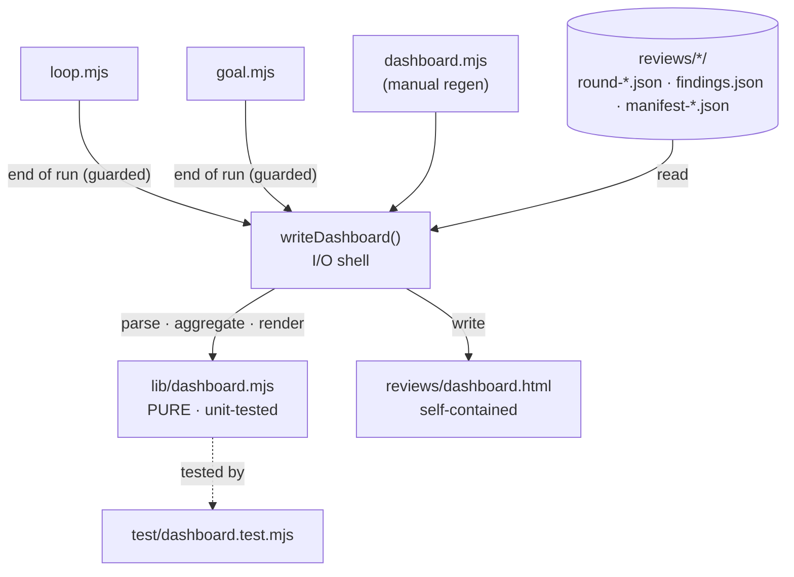
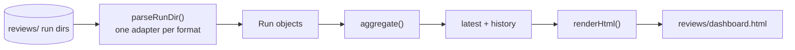
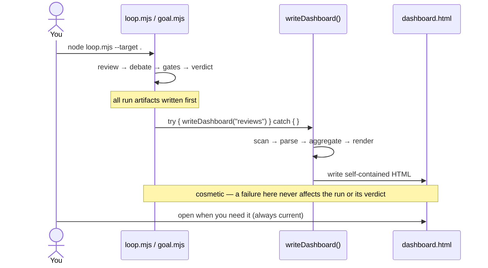

# Run Dashboard — Visual Design

Companion to `2026-06-17-run-dashboard-design.md`. The Mermaid diagrams render on GitHub
(or any Markdown preview, e.g. VS Code `Ctrl+Shift+V`).

## Architecture



## Data flow



## Auto-emit sequence



## Layout options (pick one)

`C X G` = which models agreed (Claude / Codex / Gemini): ● found it · `·` didn't.

### A — history strip on top  (matches your "detail + history strip" pick)
```
┌─ multi-review · dashboard ──────────────────┐
│ history  ▁▂▅▃▂▁   last 10 runs              │
├─────────────────────────────────────────────┤
│ LATEST · loop · 2026-06-17 23:16            │
│ CRIT 1   HIGH 3   MED 5   LOW 2             │
│ file           sev   C X G   status         │
│ sql concat     high  ● ● ●   → PLAN         │
│ missing await  med   ● · ●   fixed ✓        │
│ unbounded loop med   ● ● ·   fixed ✓        │
└─────────────────────────────────────────────┘
```

### B — two-column (latest detail + history sidebar)
```
┌─ multi-review · dashboard ──────────────────────┐
│ LATEST loop 23:16     │ HISTORY                 │
│ CRIT1 HIGH3 MED5 LOW2 │ ▁▂▅▃▂▁  findings/run    │
│ ────────────────────  │ run      crit / high    │
│ sql concat   hi ●●● →P│ 23:16     1 / 3         │
│ missing await md ●·● ✓│ 22:40     0 / 2         │
│ unbounded     md ●●· ✓│ 21:05     2 / 4         │
└───────────────────────┴─────────────────────────┘
```

### C — run cards (newest expanded, older collapsed)
```
┌─ multi-review · dashboard ──────────────────┐
│ ▾ loop · 23:16    C1 H3 M5 L2               │
│    sql concat    high  ●●●  → PLAN          │
│    missing await med   ●·●  fixed ✓         │
│ ▸ loop · 22:40    C0 H2 M3 L1               │
│ ▸ goal · 21:05    gates ✓   C2 H4  (→loop)  │
└─────────────────────────────────────────────┘
```
