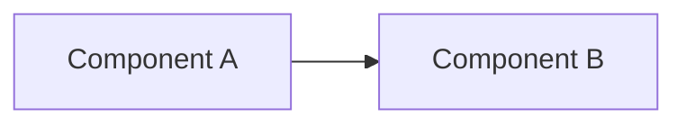

# PLAN — <goal>

> Generated by /helpmecode. Status: draft / approved. specVersion: v1.

## Constitution (invariants injected into every phase)
- <e.g. "no secrets in code; all I/O validated; public APIs typed">
- <e.g. "tests-first; no edit to test files by the implementer">
- <project-specific rules>

## Context & assumptions
- Stated: <what the user actually said>
- Assumed: <what was inferred — confirm before relying on it>
- Decisions (from research, validated): <choice — rationale — source — license/maturity>

## Architecture

## Tasks
### T1 — <title>
- **Files:** `path/one.ts`, `path/two.ts`
- **Interfaces:** `function foo(x: X): Y`
- **Change:** <the complete change, no placeholders>
- **Validate:** `<command that proves it>`
- **Acceptance:** <criteria a reviewer would check; severity terms>
- **Scope:** dirs that may change = `path/`

### T2 — <title>
- ...

## Acceptance (whole plan)
- All gates green; reviewers converge; no perimeter edits auto-merged; held-out tests pass.
