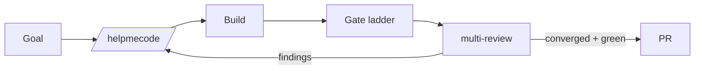

# Visuals — Mermaid by default, Playwright when useful

## Mermaid (default, zero-dependency)
Write diagrams directly into PLAN.md / DESIGN.md / ARCHITECTURE.md — they render in GitHub and most
viewers. Use the right diagram for the job:

- **Architecture / components** — `flowchart` of services, modules, boundaries.
- **Data model** — `erDiagram` (entities, relations, cardinality).
- **Behavior** — `sequenceDiagram` for request/response or event flows.
- **State** — `stateDiagram-v2` for lifecycles.

Keep each diagram small enough to read; prefer several focused diagrams over one wall.

## Playwright (optional, lazily loaded — UI work only)
Use only when pixels matter and Playwright is present (degrade gracefully otherwise):
- **Reference capture** during brainstorming: screenshot a URL the user points at, to extract design
  DNA / tokens for DESIGN.md.
- **Verify-by-running** later: screenshot the *running* build to feed the design-slop gate
  ("screenshot the just-built UI → score against the banlist → fail the gate").

Prefer **accessibility snapshots** over raw pixel diffs for assertable, reproducible pass/fail; keep
screenshots as human-auditable evidence. Write artifacts to a temp dir, never into the repo.

If Playwright isn't installed, say so and continue with Mermaid only — never hard-fail the plan on a
missing optional visual tool.
